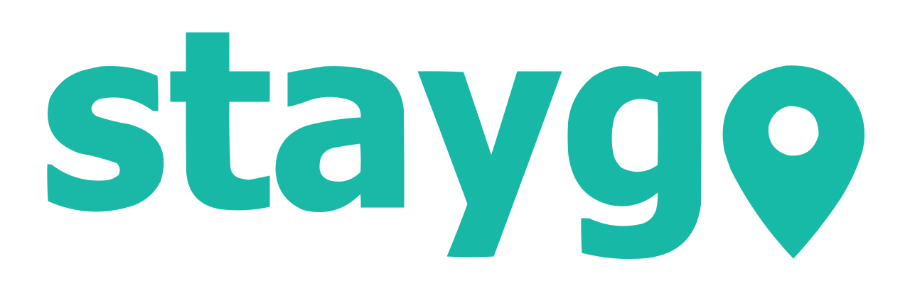

<div align="center">
    
    <h1 style="border-bottom: none;">Staygo</h1>
    <h3>Software for shared accommodation in homes</h3>
    <h1><a href="https://staygo.vercel.app/"><p>See the site</p></a></h1>
</div>

## State of the project


At the moment the project is in a stable development phase, with all functionalities added so far functional. The system may still contain some bugs, if they are found, please report them so that they can be resolved.

## Steps to install project in local environment

### Git
Install [Git](https://git-scm.com/) in your machine. 
Download the Latest source Release.

### Node.js
Install [Node.js](https://nodejs.org) in your machine. 
Download the LTS version, this is the recommended version for most users.

### Running the project in local environment

First, make a clone of the project repository to your machine.

```bash
git clone https://github.com/MarioPonte/Staygo.git
```

Install all project dependencies.

```bash
npm i
```

Create a ``.env`` file and put your special credentials.

```bash
DATABASE_URL=""
NEXTAUTH_SECRET=""

GITHUB_ID=
GITHUB_SECRET=

GOOGLE_CLIENT_ID=
GOOGLE_CLIENT_SECRET=

NEXT_PUBLIC_CLOUDINARY_CLOUD_NAME=""
```

Run the project.

```bash
npm run dev
```

Open [http://localhost:3000](http://localhost:3000) with your browser to see the result.

## Used Technologies

Here are listed all the technologies that were used for the development of the project.

- ``JavaScript``
- ``Node.js``
- ``React.js``
- ``Next.js``
- ``Tailwind CSS``
- ``MongoDB``

## Project functionalities

Here are listed all the functionalities of the project.

- `Light and Dark Mode`: Staygo supports Light and Dark modes to provide a nice and personal visual experience to our users.


